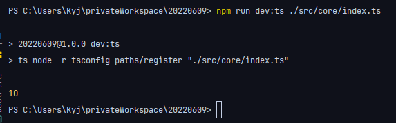

# TypeScript

```
npm init -y
npm install -D typescript ts-node @types/node
```

npx tsc index.ts

```
// 컴파일 후 바로 실행
ts-node 파일명
```

tsconfig.json 필요
```json
{
  "compilerOptions": {
    "outDir": "./dist/",
    "baseUrl": ".",
    "paths": {
      "@core/*": ["src/core/*"]
    }
  }
}

```
npx tsc --build

**index.ts**
```typescript
import { a } from "@core/utils.ts"
```

**utils.ts**
```typescript
export const a = 10
```

```
npm install -D tsconfig-paths
```

npx ts-node -r tsconfig-paths/register [파일명]

package.json 에 script 추가


유명한 라이브러리는 types/ 설치를 하면되지만,
유명하지 않은 라이브러리는 따로 해줘야하는 작업이 있다.

16진수 -> 2진수
npm install hex-to-binary

**tsconfig.json 에 환경설정 속성을 잘 체크하자! (공부하라는 뜻)**

**eslint, prettier 설정**
```
npm install -D eslint prettier eslint-plugin-prettier eslint-config-prettier
```
.eslintrc
.prettierrc

**.eslintrc**
```json
{
  "extends": ["plugin:prettier/recommended"]
}
```

**.prettierrc**
```json
{
  "printWidth": 120,
  "tabWidth": 4,
  "singleQuote": true,
  "trailingComma": "all",
  "semi": false
}
```


**테스트코드 작성하는 프레임워크**
OOP
작은것 부터 만들면서 큰거를 만들기

하지만 테스트가 힘들다. 

그래서 프레임워크의 힘을 빌리자

js,ts -> jest

```shell
$ npm install -D ts-jest @types/jest babel-core
$ npm install -D @babel/preset-typescript @babel/preset-env
```

**babel.config.js**
```javascript
module.exports = {
    presets: [
        ["@babel/preset-env", {
            targets:{node:'current'}
        }],
        '@babel/preset-typescript'
    ]
}
```

**jest.config.ts**
```typescript
import type { Config }  from '@jest/types'
const config: Config.InitialOptions = {
    
}
```


**자격증명(POW)**

채굴(마이닝)을 할 때 쉽게 블럭생성을 하지 못하도록

자격증명 이라는 로직을 넣어둔다.

자격 증명시 특정 값을 찾아야한다.

hash 값을 통해서 앞에 있는 자릿수에 0이 몇개 들어갔는가??
ex) 0011


제네시스 블럭은 네트워크를 검증하는 역할을 햐ㅏㄴ다.

http 는 block 과 chain 을 보내주는 용도 (조회용)

웹소켓이 데이터를 주고받는 용도

**16진수**

8 bit = 1 byte = 2 nibble

1 nibble = 4 bit

4 bit = 2의 4승

4 bit = 16진수

1 byte = 16진수로 2글자로 표현 가능

32 byte = 64글자


**지갑검증**

블록체인에서는 공개키를 가지고 검증하고

지갑에서는 개인키를 가지고 검증한다.
